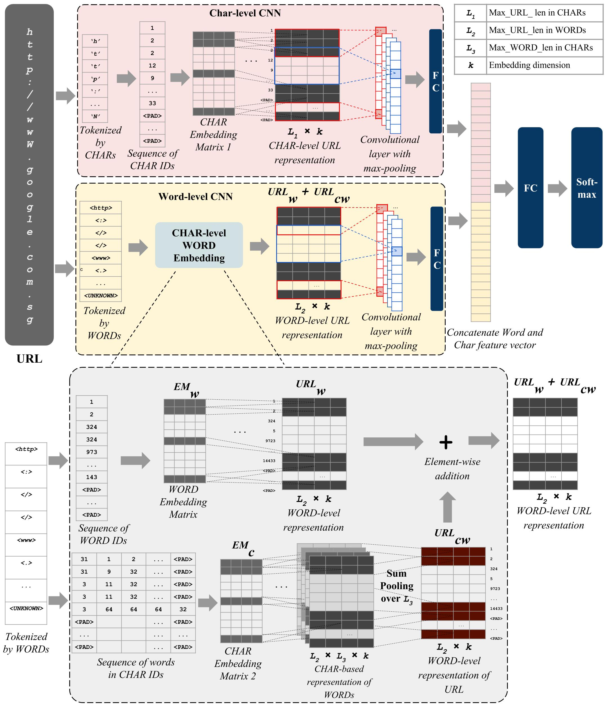

**URLNet**
==========

Introduction
------------

This is an implementation of URLNet - Learning a URL Representation with Deep
Learning for Malicious URL Detection https://arxiv.org/abs/1802.03162

URLNet is a convolutional neural network (CNN) based model used to detect
malicious URLs. The model exploits features of URL text string at both character
and word levels.

Resources
---------

URLNet requires Python 3.6 and the following packages:

-   tensorflow 1.8

-   tflearn 0.3

-   numpy 1.14

Model Designs
-------------

Sample Commands
---------------

In all datasets for training or testing, each line includes the label and the
URL text string following the template:

`<URL label><tab><URL string>`

**Example:**

~~~~~~~~~~~~~~~~~~~~~~~~~~~~~~~~~~~~~~~~~~~~~~~~~~~~~~~~~~~~~~~~~~~~~~~~~~~~~~~~
+1  http://www.exampledomain.com/urlpath/...

-1  http://www.exampledomain.com/urlpath/...
~~~~~~~~~~~~~~~~~~~~~~~~~~~~~~~~~~~~~~~~~~~~~~~~~~~~~~~~~~~~~~~~~~~~~~~~~~~~~~~~

The URL label is either +1 (Malicious) or -1 (Benign).

The model can be trained by running the following command:

~~~~~~~~~~~~~~~~~~~~~~~~~~~~~~~~~~~~~~~~~~~~~~~~~~~~~~~~~~~~~~~~~~~~~~~~~~~~~~~~
python train.py --data.data_dir <data_file_directory> --data.dev_pct 0.2 --data.delimit_mode <url_delimit_mode> --data.min_word_freq <url_min_word_freq> \
--model.emb_mode <embedding_mode> --model.emb_dim <size_of_embedding_dimensions> --model.filter_sizes <convolutional_filter_sizes_separated_by_comma> \
--train.nb_epochs <nb_of_training_epochs> --train.batch_size <nb_of_urls_per_batch> \
--log.print_every <print_acc_after_this_nb_steps> --log.eval_every <evaluate_on_dev_set_after_this_nb_steps> --log.checkpoint_every <checkpoint_model_after_this_nb_steps> --log.output_dir <model_output_folder_directory>
~~~~~~~~~~~~~~~~~~~~~~~~~~~~~~~~~~~~~~~~~~~~~~~~~~~~~~~~~~~~~~~~~~~~~~~~~~~~~~~~

The training will save all the related word and character dictionaries into an
output folder, and the model checkpoints are saved into `checkpoints/` folder.
By default, maximum 5 checkpoints are stored in the folder.

The model can be tested by running the following command:

~~~~~~~~~~~~~~~~~~~~~~~~~~~~~~~~~~~~~~~~~~~~~~~~~~~~~~~~~~~~~~~~~~~~~~~~~~~~~~~~
python test.py --data.data_dir <data_file_directory> --data.delimit_mode <url_delimit_mode> --data.word_dict_dir <word_dictionary_directory> --data.subword_dict_dir <character_in_word_dictionary_directory> --data.char_dict_dir <character_dictionary_directory> \
--log.checkpoint_dir <model_checkpoint_directory> --log.output_dir <test_result_directory> \
--model.emb_mode <embedding_mode> --model.emb_dim <nb_of_embedding_dimensions> \
--test.batch_size <nb_of_urls_per_batch>
~~~~~~~~~~~~~~~~~~~~~~~~~~~~~~~~~~~~~~~~~~~~~~~~~~~~~~~~~~~~~~~~~~~~~~~~~~~~~~~~

The test will save the test results for each URL, including 3 columns: `label`
(original label), `predict` (prediction label), and `score` (softmax score). The
orders of test results from top to bottom are the same as their orders in the
test dataset. If the score is more than 0.5, prediction label is +1 (Malicious).
Else, the prediction is -1 (Benign).

**Example:**
~~~~~~~~~~~~~~~~~~~~~~~~~~~~~~~~~~~~~~~~~~~~~~~~~~~~~~~~~~~~~~~~~~~~~~~~~~~~~~~~
label predict score
1 1 0.884
\-1 -1 0.359
~~~~~~~~~~~~~~~~~~~~~~~~~~~~~~~~~~~~~~~~~~~~~~~~~~~~~~~~~~~~~~~~~~~~~~~~~~~~~~~~

To obtain test metrics such as True Positive, False Positive, True Negative,
False Negative, and the AUC curves, run the following command:

~~~~~~~~~~~~~~~~~~~~~~~~~~~~~~~~~~~~~~~~~~~~~~~~~~~~~~~~~~~~~~~~~~~~~~~~~~~~~~~~
python auc.py --input_path <test_result_directory> --input_file
<test_result_file>
~~~~~~~~~~~~~~~~~~~~~~~~~~~~~~~~~~~~~~~~~~~~~~~~~~~~~~~~~~~~~~~~~~~~~~~~~~~~~~~~

The command will output the test metrics into a file with the same name as the
`input_file` but with an `.auc` extension.

Parameters
----------

Training parameters include:

| **Parameter**         | **Description**                                                                                                                                                                                 | **Default**     |
|-----------------------|-------------------------------------------------------------------------------------------------------------------------------------------------------------------------------------------------|-----------------|
| data.max_len_words    | The maximum number of words in a URL. The URL is either truncated or padded with a `<PADDING>` token to reach this length.                                                                      | 200             |
| data.max_len_chars    | The maximum number of characters in a URL. The URL is either truncted or padded with a `<PADDING>` character to reach this length.                                                              | 200             |
| data.max_len_subwords | The maximum number of characters in each word in a URL. Each word is either truncated or padded with a `<PADDING>` character to reach this length.                                              | 20              |
| data.min_word_freq    | Words that have frequency less than or equal to this parameter are considered as rare words, and represented as a single `<UNKNOWN>` token.                                                     | 1               |
| data.dev_pct          | Percentage of training data used for validation                                                                                                                                                 | 0.001           |
| data.data_dir         | Directory of the training dataset                                                                                                                                                               | train_10000.txt |
| data.delimit_mode     | 0: delimit URL by special characters (i.e. non-alphanumerical characters), 1: delimit URL by special characters (i.e. non-alphanumerical characters) and treat each special characters as words | 1               |
| model.emb_dim         | Dimension size of word and character embedding.                                                                                                                                                 | 32              |
| model.emb_mode        | 1: only character-based CNN, 2: only word-based CNN, 3: character and word CNN, 4: character-level word CNN, 5: character and character-level word CNN                                          | 1               |
| model.filter_sizes    | Sizes of convolutional filters. If more than one branches of CNN, all will have the same set of filter sizes. Separate the filter sizes by comma.                                               | 3,4,5,6         |
| train.batch_size      | Number of URLs in each training batch                                                                                                                                                           | 128             |
| train.nb_epochs       | Number of training epochs                                                                                                                                                                       | 5               |
| train.lr              | Learning rate                                                                                                                                                                                   | 0.001           |
| train.l2_reg_lambda   | regularization parameter of loss function                                                                                                                                                       | 0               |
| log.output_dir        | Output folder to save dictionaries and model checkpoints                                                                                                                                        | runs/10000/     |
| log.print_every       | Output the training loss and accuracy after this number of batches                                                                                                                              | 50              |
| log.eval_every        | Evaluate the model on the validation set after this number of batches                                                                                                                           | 500             |
| log.checkpoint_every  | Checkpoint the model after this number of batches. Only save the model checkpoint if the validation loss is improved.                                                                           | 500             |

 

Test parameters include:

| **Parameter**         | **Description**                                                                                                                                                                                 | **Default**                          |
|-----------------------|-------------------------------------------------------------------------------------------------------------------------------------------------------------------------------------------------|--------------------------------------|
| data.max_len_words    | The maximum number of words in a URL. The URL is either truncated or padded with a `<PADDING>` token to reach this length.                                                                      | 200                                  |
| data.max_len_chars    | The maximum number of characters in a URL. The URL is either truncted or padded with a `<PADDING>` character to reach this length.                                                              | 200                                  |
| data.max_len_subwords | The maximum number of characters in each word in a URL. Each word is either truncated or padded with a `<PADDING>` character to reach this length.                                              | 20                                   |
| data.delimit_mode     | 0: delimit URL by special characters (i.e. non-alphanumerical characters), 1: delimit URL by special characters (i.e. non-alphanumerical characters) and treat each special characters as words | 1                                    |
| data.data_dir         | Directory of the test dataset                                                                                                                                                                   | test_1000.txt                        |
| data.word_dict_dir    | Directory of the word dictionary file. Dictionary file is in pickle extension `.p`                                                                                                              | runs/10000/words_dict.p              |
| data.char_dict_dir    | Directory of the character dictionary file. Dictionary file is in pickle extension `.p`                                                                                                         | runs/10000/chars_dict.p              |
| data.subword_dict_dir | Directory of the character-in-word dictionary file. Dictionary file is in pickle extension `.p`                                                                                                 | runs/10000/ngrams_dict.p             |
| model.emb_dim         | Dimension size of word and character embedding.                                                                                                                                                 | 32                                   |
| model.emb_mode        | 1: only character-based CNN, 2: only word-based CNN, 3: character and word CNN, 4: character-level word CNN, 5: character and character-level word CNN                                          | 1                                    |
| test.batch_size       | Number of URLs in each test batch                                                                                                                                                               | 128                                  |
| log.checkpoint_dir    | Directory of the model checkpoints                                                                                                                                                              | runs/10000/checkpoints/              |
| log.output_dir        | Directory of the test results                                                                                                                                                                   | runs/10000/train_10000_test_1000.txt |

The test parameters such as `model.emb_mode` and `data.delimit_mode` have to be
consistent with the trained model to get accurate test results.

Refer to the file `run.sh` for example commands.

Acknowledgement
---------------

We are very grateful to our collaborators VirusTotal, for providing us access to
their data, without which this research would not have been possible.

